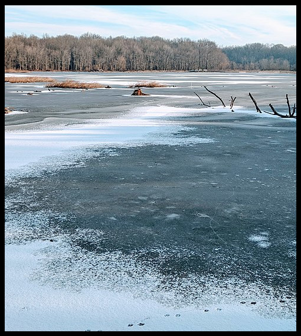

::: columns
::: {.column width="47.5%"}
{width="350px"}
:::

::: {.column width="5%"}

:::
::: {.column width="47.5%"}
    The best time to be out on the water is on those bright, sunny days, dressed
  for the weather with a line cast into crystal clear waters.
    This is what I was telling myself as I stood on the translucent ice atop a lake
  In the middle of Superior National Forest, shivering in the 0 F morning air. Though   it is an arguably dismal time to be doing work of any kind in the field, these are    the pefect
:::
:::